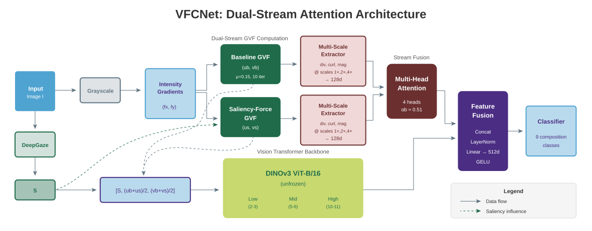

# VFCNet

Official PyTorch implementation of VFCNet for photographic image composition classification. This model uses Gradient Vector Flow (GVF) features combined with DINOv3 representations.


*Figure 1: VFCNet Architecture - Dual-stream GVF extraction with attention-based fusion and multi-scale DINOv3 feature extraction.*

The architecture processes images through:
1. **Saliency computation** using DeepGaze IIE
2. **Dual-stream GVF extraction** (baseline and saliency-enhanced)
3. **Attention-based fusion** of GVF streams
4. **Multi-scale feature extraction** using DINOv3 ViT-B/16
5. **Differential GVF feature computation** (divergence, curl, magnitude)
## Requirements

- Python 3.8+
- PyTorch 2.0+
- CUDA 11.8+

Install dependencies:
```bash
pip install torch torchvision numpy opencv-python pillow tqdm pyyaml scikit-learn deepgaze-pytorch scipy
```

## Datasets

**KU-PCP** (training): [http://mcl.korea.ac.kr/research/Submitted/jtlee_JVCIR2018/KU_PCP_Dataset.zip](http://mcl.korea.ac.kr/research/Submitted/jtlee_JVCIR2018/KU_PCP_Dataset.zip)

**PICD** (evaluation): [https://github.com/CV-xueba/PICD_ImageComposition/tree/main](https://github.com/CV-xueba/PICD_ImageComposition/tree/main)

## Setup

Update the paths in `config.py` (PathConfig class):

```python
kupcp_root: Path = Path("/your/path/to/kupcp")     # KU-PCP dataset
picd_root: Path = Path("/your/path/to/PICD")       # PICD dataset  
cache_root: Path = Path("/your/path/to/cache")     # Saliency cache (auto-generated)
picd_cache_root: Path = Path("/your/path/to/picd_cache")
dino_repo: str = "/your/path/to/dinov3"            # path to dinov3 ViT\B-16
dino_weights: str = "/your/path/to/dinov3_vitb16_pretrain.pth"
```

### Saliency Cache

The saliency cache is **generated automatically** on first run using DeepGaze IIE.

To pre-generate the cache manually:
```bash
# Generate KUPCP cache (required for training)
python generate_cache.py --dataset kupcp

# Generate PICD cache (required for evaluation)
python generate_cache.py --dataset picd
```

Cache structure:
```
cache_root/
├── train/
│   ├── 0001.pt  # {"inputs": tensor(3,224,224), "multi_label": tensor(9)}
│   └── ...
└── test/
    └── ...
```

## Training

```bash
python train.py --seed 42 --epochs 30 --lr 5e-5 --batch_size 16
```

Key arguments:
- `--seed`: Random seed (default: 42)
- `--epochs`: Training epochs (default: 30)
- `--lr`: Learning rate (default: 5e-5)
- `--gvf_mu`: GVF diffusion parameter (default: 0.15)
- `--gvf_iterations`: GVF iterations (default: 10)

## Evaluation

```bash
python eval.py --checkpoint output/checkpoints/model.pt
```

This computes CDA-1 and CDA-2 metrics on PICD.

## Results

| Seed | KUPCP F1 | CDA-1 | CDA-2 |
|------|----------|-------|-------|
| 1111 | 0.786 | 0.688 ± 0.002 | 0.625 ± 0.008 |

Target from paper: CDA-1=0.683±0.002, CDA-2=0.629±0.004

## Files

- `train.py` - Training script
- `eval.py` - Evaluation script with CDA computation
- `generate_cache.py` - Saliency cache generator (auto-runs if cache missing)
- `model.py` - VFCNet architecture
- `gvf.py` - Gradient Vector Flow computation
- `config.py` - Configuration dataclasses
- `config.yaml` - Default hyperparameters
- `labels_PICD.csv` - PICD semantic labels for CDA-2 evaluation

## Citation

```bibtex
@inproceedings{vfcnet2025,
  title={Semantically Stable Image Composition Analysis via Saliency and Gradient Vector Flow Fusion},
  author={Armin Dadras, Robert Sablatnig, Franziska Proska, Markus Seidl},
  booktitle={},
  year={2026}
}
```
